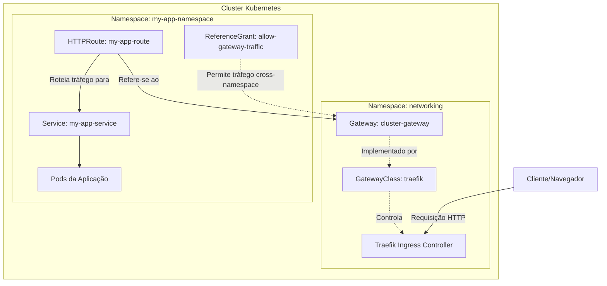

# Infraestrutura Kubernetes (K3s)

Este diretório contém os manifestos de infraestrutura base para o cluster K3s, com foco especial na configuração de rede moderna utilizando o **Kubernetes Gateway API** em conjunto com o Traefik.

> ⚠️ **NOTA TÉCNICA IMPORTANTE:**
> No K3s, o Traefik é configurado por padrão para escutar na porta `8000` dentro do container (mapeada para a porta `80` do host via Service). Para que a Gateway API funcione corretamente, o Listener do Gateway deve apontar para a porta `8000` e possuir a anotação `traefik.io/gateway.entrypoints: web`. Caso contrário, o status permanecerá como `PortUnavailable`.

---

## 📂 Modelo de Arquitetura de Diretórios

Para manter a organização e escalabilidade do cluster, recomendamos e seguimos a seguinte estrutura de diretórios como modelo para os projetos:

```text
k3s-proxmox-cluster/ 
 ├── traefik-gateway-rbac.yaml 
 ├── bootstrap/               # Arquivos de inicialização do cluster (CRDs) 
 │   └── gateway-api-crds.yaml 
 ├── infrastructure/          # Ferramentas que dão suporte ao cluster 
 │   ├── networking/          # Traefik, Gateway, Certificados 
 │   │   ├── gateway-class.yaml 
 │   │   ├── gateway.yaml 
 │   │   ├── http-route-template.yaml 
 │   │   ├── reference-grant.yaml 
 │   │   └── traefik-gateway-rbac.yaml 
 │   ├── cert-manager/ 
 │   │   └── cert-manager-values.yaml 
 │   └── monitoring/ 
 │       └── prometheus-values.yaml 
 ├── apps/                     # Suas aplicações de fato 
 │   ├── awx/                  # Projeto AWX 
 │   │   ├── arquivo_01.yaml  
 │   │   └── arquivo_02.yaml 
 │   ├── prometheus/           # Projeto Prometheus 
 │   │   ├── arquivo_01.yaml  
 │   │   └── arquivo_02.yaml 
 │   ├── staging/              # Apps de teste 
 │   │   └── hello-world.yaml 
 │   └── production/           # Apps de produção 
 │   │   └── hello-world.yaml 
 └── scripts/                  # Scripts auxiliares (ex: limpeza, backup) 
     └── install-all.sh
```

Para criar rapidamente esta estrutura de diretórios base no seu ambiente, você pode executar o seguinte comando:

```bash
mkdir -p k3s-cluster/{bootstrap,infrastructure/networking,infrastructure/cert-manager,infrastructure/monitoring,apps/awx,apps/staging,apps/production,scripts}
```

---

## 🌐 Networking (Gateway API)

A pasta `networking/` possui as configurações essenciais para expor aplicações para fora do cluster de forma segura e estruturada, substituindo a antiga abordagem de Ingress tradicional pela nova especificação Gateway API.

### 🏛️ Arquitetura de Roteamento

O modelo de roteamento segue a seguinte estrutura lógica:



### 📄 Descrição dos Arquivos

| Arquivo | Propósito | Onde/Quando Aplicar |
| :--- | :--- | :--- |
| `traefik-gateway-rbac.yaml` | Concede as permissões (ClusterRole e RoleBinding) necessárias para que o Traefik possa ler e interagir com os recursos da Gateway API. | Uma única vez, na configuração inicial do cluster. |
| `gateway-class.yaml` | Define a classe de Gateway (`traefik`), indicando qual controlador (`traefik.io/gateway-controller`) será responsável por gerenciar os Gateways criados a partir dela. | Uma única vez, na configuração inicial do cluster. |
| `gateway.yaml` | Cria o ponto de entrada principal (`cluster-gateway` no namespace `networking`). Ele escuta o tráfego HTTP e permite que aplicações de **qualquer namespace** criem rotas (`HTTPRoute`) apontando para ele. | Uma única vez, na configuração inicial do cluster. |
| `http-route-template.yaml` | Arquivo de **modelo** (template) que ensina como expor sua aplicação. Ele vincula um hostname (ex: `app.example.local`) ao seu `Service` interno, usando o `cluster-gateway`. | Sempre que for fazer o deploy de uma **nova aplicação**. |
| `reference-grant.yaml` | Arquivo de **modelo** (template) para segurança cross-namespace. Como o Gateway está em `networking` e sua aplicação em outro namespace, isso permite explicitamente que o Gateway encaminhe tráfego para o seu `Service`. | Sempre que for expor uma aplicação que está em um **namespace diferente** do Gateway. |

---

## 🚀 Como Utilizar (Passo a Passo)

### 1. Configuração Base da Infraestrutura (Admin)
Estes passos são realizados apenas uma vez, pelo administrador do cluster, para preparar o ambiente:

```bash
# Entre no diretório de rede
cd networking/

# 1. Aplicar as permissões de RBAC para o Traefik gerenciar o Gateway API
kubectl apply -f traefik-gateway-rbac.yaml

# 2. Criar a classe do Gateway (indica que usaremos o Traefik)
kubectl apply -f gateway-class.yaml

# 3. Subir o Gateway central do cluster
kubectl apply -f gateway.yaml
```

### 2. Expondo uma Aplicação (Desenvolvedor)
Sempre que você criar uma nova aplicação no cluster e quiser expô-la (por exemplo, `meu-site.local`), utilize os templates:

1. **Copie e ajuste o HTTPRoute:**
   Pegue o `http-route-template.yaml`, ajuste o `namespace`, `name`, `hostname` e aponte para o nome e a porta do seu `Service`.
   
2. **Copie e ajuste o ReferenceGrant:**
   Pegue o `reference-grant.yaml`, ajuste o `namespace` (para o namespace da sua aplicação) e altere o `name` do Service no final do arquivo para liberar a comunicação do Gateway até sua aplicação.

3. **Aplique no cluster:**
   ```bash
   kubectl apply -f seu-http-route.yaml
   kubectl apply -f seu-reference-grant.yaml
   ```

### 📝 Notas Importantes
- **Gateway API CRDs:** O cluster já deve possuir as Custom Resource Definitions (CRDs) do Gateway API instaladas.
- **DNS:** Certifique-se de que o hostname configurado no `HTTPRoute` resolva para o IP dos nós (ou do LoadBalancer/MetalLB) onde o Traefik está rodando.