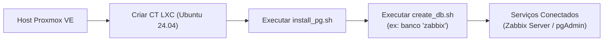

# 🐘 Scripts de Gerenciamento do PostgreSQL 16 e TimescaleDB

Este diretório contém scripts de automação para instalação, configuração e provisionamento de bancos de dados **PostgreSQL 16** integrado com a extensão de séries temporais **TimescaleDB** em servidores e contêineres Linux (VMs e LXC no Proxmox VE).

---

## 📜 Estrutura do Diretório

```
scripts-postgres/
├── create_db.sh
├── install_pg.sh
└── README.md
```

---

## 💻 Compatibilidade de Sistemas Operacionais e Ambientes

Os scripts foram desenvolvidos e homologados especificamente para distribuições baseadas em **Ubuntu Linux** (`amd64`), devido ao provisionamento dos repositórios oficiais do PostgreSQL Global Development Group (PGDG) e do repositório APT do TimescaleDB via Packagecloud.

### 🐧 Distribuições e Versões de SO Suportadas

| Sistema Operacional | Codinome | Arquitetura | Status de Suporte | Observações |
| :--- | :--- | :--- | :--- | :--- |
| **Ubuntu Server 24.04 LTS** | `noble` | `amd64` / `x86_64` | 🟢 **Recomendado** | Versão homologada e ideal para novos deployments (Kernel 6.8+) |
| **Ubuntu Server 22.04 LTS** | `jammy` | `amd64` / `x86_64` | 🟢 **Suportado** | Totalmente testado, estável e compatível |
| **Ubuntu Server 20.04 LTS** | `focal` | `amd64` / `x86_64` | 🟡 **Compatível** | Funcional, mas recomenda-se versões mais recentes devido ao ciclo de suporte |
| **Debian GNU/Linux (11 / 12)** | `bullseye` / `bookworm` | `amd64` | 🔴 **Não Suportado Diretamente** | Incompatível sem alterações manuais (o script aponta para o repositório Ubuntu do Timescale) |
| **RHEL / Rocky / AlmaLinux** | - | `x86_64` | 🔴 **Não Suportado** | Utilizam gerenciador de pacotes `dnf`/`rpm` (os scripts utilizam `apt`) |
| **Alpine Linux** | - | `x86_64` | 🔴 **Não Suportado** | Utiliza `apk` e biblioteca `musl` (incompatível com o instalador APT) |

> [!NOTE]
> A recomendação oficial para o ambiente Proxmox VE é utilizar **Ubuntu Server 24.04 LTS** (ou 22.04 LTS) tanto em **Contêineres LXC** quanto em **Máquinas Virtuais (VMs)**.

### 🏢 Ambientes de Virtualização (Proxmox VE)

| Tipo de Ambiente | Suporte | Notas |
| :--- | :--- | :--- |
| **Contêiner LXC (Unprivileged)** | 🟢 Suportado (Recomendado) | Baixo consumo de memória e inicialização instantânea. Excelente para bancos dedicados. |
| **Contêiner LXC (Privileged)** | 🟢 Suportado | Funciona perfeitamente. |
| **Máquina Virtual (QEMU/KVM)** | 🟢 Suportado | Ideal para ambientes que necessitam de isolamento total de kernel e recursos dedicados. |

---

## 🚀 Scripts Disponíveis

### 1. `install_pg.sh` (Instalador do PostgreSQL 16 + TimescaleDB)

- **Compatibilidade**:
  - Ubuntu Server 24.04 LTS (Recomendado)
  - Ubuntu Server 22.04 LTS
  - Ubuntu Server 20.04 LTS

- **Função**:
  Realiza a instalação e configuração automatizada do **PostgreSQL 16** e do **TimescaleDB 2**, além de executar a otimização de parâmetros de performance do sistema e gerenciar o acesso de rede.

- **Onde e Quando Utilizar**:
  - **Onde**: Deve ser executado diretamente no host (VM ou contêiner LXC) dedicado a atuar como servidor de banco de dados.
  - **Quando**: No provisionamento inicial do servidor de banco de dados, antes de configurar aplicações que necessitam de armazenamento relacional ou de séries temporais (como Zabbix Server, Grafana, OnlyOffice, APIs, etc.).

- **Etapas Executadas pelo Script**:
  1. **Atualização do Sistema**: Atualiza a lista de pacotes (`apt update && apt upgrade -y`) e instala utilitários pré-requisito (`gnupg`, `postgresql-common`, `apt-transport-https`, `lsb-release`, `wget`).
  2. **Repositório Oficial PostgreSQL**: Adiciona o repositório oficial da comunidade PostgreSQL (PGDG) através do utilitário oficial `apt.postgresql.org.sh`.
  3. **Repositório TimescaleDB**: Importa a chave GPG segura (`packagecloud.io`) e configura o repositório oficial do TimescaleDB no APT.
  4. **Instalação dos Pacotes**: Instala o `postgresql-16` e o módulo `timescaledb-2-postgresql-16`.
  5. **Configuração de Acesso de Rede (Interativo)**:
     - Pergunta se deseja liberar acesso externo (ex: conexões remotas via pgAdmin, DBeaver ou aplicações em outros hosts).
     - **Se confirmado**: Configura `listen_addresses = '*'` em `postgresql.conf` e adiciona regra permissiva com criptografia moderna (`host all all 0.0.0.0/0 scram-sha-256`) em `pg_hba.conf`.
     - **Se negado**: Mantém o acesso restrito localmente (`localhost`).
  6. **Tuning Automático (`timescaledb-tune`)**: Executa a ferramenta oficial `timescaledb-tune --quiet --yes`, que analisa a quantidade de memória RAM e CPUs disponíveis na máquina para ajustar parâmetros de cache (`shared_buffers`, `effective_cache_size`, `work_mem`, `max_worker_processes`).
  7. **Habilitação de Serviço**: Reinicia o PostgreSQL para carregar as novas configurações e habilita o serviço no `systemd` para iniciar automaticamente com o sistema.

- **Como Utilizar**:
  ```bash
  # 1. Dar permissão de execução
  chmod +x install_pg.sh

  # 2. Executar como superusuário
  sudo ./install_pg.sh
  ```

---

### 2. `create_db.sh` (Assistente de Criação de Banco e Usuário)

- **Compatibilidade**:
  - Ubuntu Server 24.04 LTS (Recomendado)
  - Ubuntu Server 22.04 LTS
  - Ubuntu Server 20.04 LTS
  - Distribuições Linux baseadas em Debian com PostgreSQL 16 e cliente `psql` instalados

- **Função**:
  Assistente interativo que provisiona com facilidade um novo banco de dados, usuário dedicado com senha criptografada, concede todos os privilégios necessários e opcionalmente inicializa a extensão **TimescaleDB** no banco criado.

- **Onde e Quando Utilizar**:
  - **Onde**: Deve ser executado no próprio servidor de banco de dados (onde o `install_pg.sh` já foi executado previamente).
  - **Quando**: Sempre que uma nova aplicação ou serviço precisar de um banco de dados dedicado e isolado (por exemplo, ao implantar o Zabbix Server, Grafana, n8n, microsserviços, etc.).

- **Recursos Principais**:
  - **Entrada Segura de Senha**: Utiliza o comando interativo com modo oculto (`read -s`), impedindo que a senha digitada fique visível no terminal ou gravada no histórico de comandos (`.bash_history`).
  - **Criação com Ownership Correto**: Executa `CREATE USER` e `CREATE DATABASE ... OWNER ...`, garantindo que o novo usuário seja o proprietário exclusivo do banco.
  - **Concessão Completa de Privilégios**: Aplica `GRANT ALL PRIVILEGES ON DATABASE` garantindo controle total ao usuário da aplicação.
  - **Suporte ao TimescaleDB**: Pergunta de forma interativa se a extensão TimescaleDB deve ser habilitada no novo banco (`CREATE EXTENSION IF NOT EXISTS timescaledb;`), ideal para tabelas de métricas e particionamento temporal automático.
  - **Geração de Connection String**: Identifica automaticamente o IP primário do host/contêiner via `hostname -I` e exibe a URL pronta para conexão no formato padrão:
    ```text
    postgresql://<usuario>:<senha>@<ip-servidor>:5432/<nome-banco>
    ```

- **Como Utilizar**:
  ```bash
  # 1. Dar permissão de execução
  chmod +x create_db.sh

  # 2. Executar como superusuário
  sudo ./create_db.sh
  ```

---

## 💡 Fluxo de Trabalho Recomendado no Proxmox VE

Um cenário típico de uso dentro do Proxmox VE é provisionar um contêiner LXC leve para centralizar bancos de dados:



1. **Provisione um Contêiner LXC ou VM**:
   - Utilize um template Ubuntu Server (22.04 ou 24.04).
   - Defina os recursos (ex: 2 a 4 vCPUs, 2 a 8 GB RAM dependendo da carga).
2. **Execute a Instalação**:
   - Clone este repositório ou transfira a pasta `scripts-postgres` para a máquina.
   - Execute o script `install_pg.sh`.
3. **Crie a Base de Dados**:
   - Execute `create_db.sh` para cada aplicação (ex: Zabbix).
   - Se for para o Zabbix, confirme a ativação da extensão TimescaleDB quando solicitado.
4. **Conecte sua Aplicação**:
   - Utilize a string de conexão informada no final do assistente nas configurações do seu serviço.

---

## 🔒 Boas Práticas e Segurança

- **Controle de Firewall**: Se você liberou acesso externo durante a instalação, restrinja o acesso à porta `5432` no Firewall do Proxmox VE ou via `ufw` apenas para os IPs dos clientes autorizados:
  ```bash
  sudo ufw allow from <IP_DO_CLIENTE> to any port 5432 proto tcp
  ```
- **Autenticação SCRAM-SHA-256**: O script configura o método moderno e seguro de senhas `scram-sha-256` no `pg_hba.conf`, prevenindo ataques de interceptação de credenciais.
- **Backups**: Recomenda-se configurar agendamentos periódicos de backup no Proxmox VE (`vzdump` para o container LXC/VM) ou rotinas com `pg_dump` para proteção lógica dos dados.
